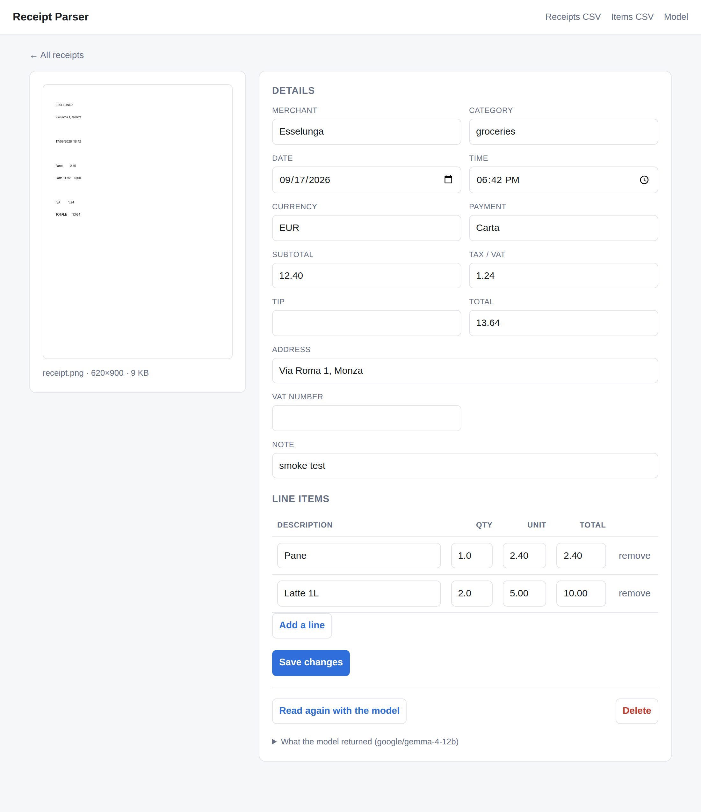

# Receipt Parser

Photograph a receipt, have a local vision model read it, keep the data and the
photo in one SQLite file. Nothing leaves your machine — the model runs in
LM Studio on localhost.



## Requirements

- Python 3.11+
- [LM Studio](https://lmstudio.ai) with a **vision** model loaded and its server
  started (Developer tab → Start Server, default `http://127.0.0.1:1234`)

## Setup

```bash
python3 -m venv .venv && source .venv/bin/activate
pip install -r requirements.txt
cp .env.example .env          # then check LMSTUDIO_MODEL matches your loaded model
python -m app
```

Open http://127.0.0.1:8000.

Visit **/models** to see exactly what LM Studio is serving; paste the right
identifier into `LMSTUDIO_MODEL` in `.env` and restart. A text-only model will
reject the image, so make sure it's a vision one.

## What it does

- **Upload** a photo (drag in a file, or use your phone camera on the file picker).
- **Extract** merchant, address, VAT number, date, time, currency, subtotal,
  tax, tip, total, payment method, category, and every line item.
- **Store** all of it in SQLite, photo included, as a BLOB — one file to back up.
- **Edit** anything the model got wrong, including adding and removing line items.
- **Re-read** a receipt with the model after you swap models or tune the prompt.
- **Export** to CSV, one file per receipt row and one per line item.
- **Search** by merchant, note, or category.

The detail page flags receipts where the line items don't add up to the stated
total — the most common way a local model gets a receipt wrong.

## Configuration

All in `.env` (see `.env.example`):

| Setting | Default | Notes |
| --- | --- | --- |
| `LMSTUDIO_BASE_URL` | `http://127.0.0.1:1234/v1` | LM Studio's OpenAI-compatible endpoint |
| `LMSTUDIO_API_KEY` | `lm-studio` | LM Studio ignores it, but the header must exist |
| `LMSTUDIO_MODEL` | `google/gemma-4-12b` | must match what `/models` reports |
| `LMSTUDIO_TIMEOUT` | `300` | seconds; local vision models are slow |
| `DATABASE_PATH` | `receipts.db` | relative paths resolve next to this README |
| `DATE_ORDER` | `day` | `day` for UK/EU receipts, `month` for US |
| `MAX_IMAGE_EDGE` | `1600` | longest edge sent to the model; smaller is faster but loses small print |

Change the host or port with `HOST` and `PORT`; set `RELOAD=1` while developing.

## How the model call works

Two details drive the design of `app/extractor.py`:

1. **Gemma's chat template has no system role.** The instruction and the image
   go together in a single user turn.
2. **JSON-schema mode isn't supported by every model LM Studio can load.** The
   app asks for structured output, and if the server answers `400`, retries the
   same request with plain prompting. Either way the response goes through
   `app/parsing.py`, which digs the JSON out of code fences or surrounding
   prose and coerces the values — `£12.50`, `12,50` and `1.234,56` all land as
   floats, and dates are read in the order `DATE_ORDER` specifies.

If the model can't be reached or returns nothing usable, **the photo is still
saved**. The receipt appears in the list marked "not read", and you can either
fix LM Studio and press *Read again with the model*, or type the details in.

## Data model

```
images     id, sha256 (unique), mime_type, filename, byte_size,
           width, height, data BLOB, thumbnail BLOB, created_at
receipts   id, image_id → images, merchant, merchant_address, merchant_vat_id,
           purchased_on, purchased_at, currency, subtotal, tax, tip, total,
           payment_method, category, notes, model, raw_response,
           extraction_error, created_at, updated_at
line_items id, receipt_id → receipts, position, description,
           quantity, unit_price, line_total
```

Photos are de-duplicated by SHA-256: upload the same picture twice and you get
two receipts sharing one stored image. Deleting a receipt drops its photo only
when no other receipt still points at it.

`raw_response` keeps exactly what the model said, so you can see where a bad
reading came from — it's under *What the model returned* on the detail page.

Query it directly whenever you like:

```bash
sqlite3 receipts.db "SELECT purchased_on, merchant, total FROM receipts ORDER BY 1 DESC LIMIT 10;"
```

## Tests

```bash
pip install pytest
python -m pytest
```

56 tests covering amount/date/time parsing, JSON recovery from messy model
output, the schema-rejection fallback, and the upload → store → edit → export
round trip. LM Studio is stubbed out, so the suite runs without it.
